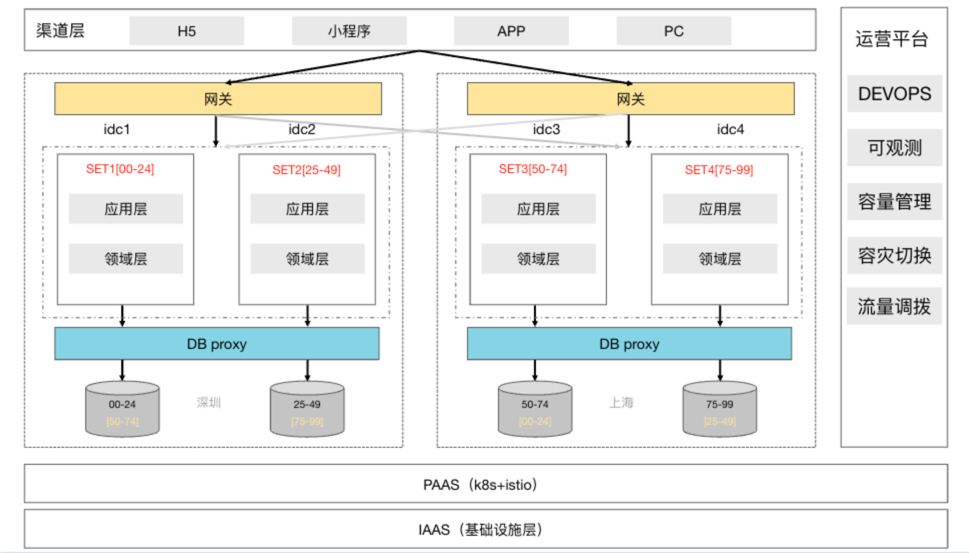

# 亿级用户中心实战

该项目采用云原生的基础设施完成用户中心建设。

## 整体架构图

- 两地四中心：数据层保证在存在同城的两个中心，亿级一个异地（异步）中心；
- 数据分片：按用户尾号分片，DB分片不一定需要和逻辑层一致；随着数据增长DB会继续拆，拆分方法为百库十表；
- 容灾处理：同城两IDC互为灾备，异步容灾需要核对数据后切换；
  

## 开发规范

### 模块划分

| 模块                        | 功能     | 错误码前缀 | 部署方案     |
|---------------------------|--------|-------|----------|
| protocol                  | 协议管理   | -     | -        |
| user-server-app           | 用户应用层  | 20000 | user-set |
| user-server-domain        | 用户领域层  | 21000 | user-set |
| middleware-distributed-id | 分布式ID  | 90000 | idc      |
| external-gateway          | 入口业务网关 | 91000 | idc      |
| internal-gateway          | 内网业务网关 | 92000 | idc      |
| db-proxy                  | DB代理   | -     | idc      |

set命名：业务加set+两位编号，十位基本代表城市，同一个城市用一个数字。
约定0：深圳，1：上海

### 用户SET 划分

两地4中心架构，深圳上海两地流量均分。

- user-set00:用户尾号00-24
- user-set01:用户尾号25-49
- user-set10:用户尾号50-74
- user-set11:用户尾号75-99

### 数据分片

**分片规则**  
以用户尾号后3位确定分片规则，初期采用百库十表逻辑。

部署4套主DB,后期可以DB层自己扩，数据分片与set分片是解耦的，但要保证set和db分片城市级对应关系。

user-db00: 处理尾号00-24
user-db01: 处理尾号25-49
user-db10: 处理尾号50-74
user-db11: 处理尾号75-99

```text
例uid: xxxx351
后两位确定DB为user-db10,百位确定表为3号表
```

### 调用规范

待补

## K8s 环境

### 安装

实验安装使用简易版本[Rancher Desktop](https://rancherdesktop.io/)

### Dashboard 安装

[https://github.com/kubernetes/dashboard](https://github.com/kubernetes/dashboard)

```shell
kubectl apply -f https://raw.githubusercontent.com/kubernetes/dashboard/v2.7.0/aio/deploy/recommended.yaml
kubectl proxy
```

[访问](http://localhost:8001/api/v1/namespaces/kubernetes-dashboard/services/https:kubernetes-dashboard:/proxy/)

## 访问token

https://github.com/kubernetes/dashboard/blob/master/docs/user/access-control/creating-sample-user.md

```shell
# 创建用户
kubectl apply -f dashboard-adminuser.yaml
# 生成token 可以多次，默认有效期较短，可以参数定制有效期
kubectl  create token admin-user -n kubernetes-dashboard [--duration 10h|m|s]
```

### 常用支持

**自助查询**

```shell
kubectl -h
kubectl get -h
# 常用命令总结
# 支持缩写 个人习惯全写免得混淆 deployments == deploy nodes == no services == svc
kubectl get all -n namespace
kubectl get deployments|nodes|pods|services|rs|configMap|crd [name]  [-A 全部空间] [-n 指定空间] -o wide [--show-labels 展示标签] [-l k=v,k1=v1 选择label]
kubectl describe deployments|nodes|pods|services|rs|configMap  name -n 空间
kubectl delete deployments|nodes|pods|services|rs|configMap name -n namespace
kubectl edit deployments|nodes|pods|services|rs|configMap name -n namespace
kubectl exec pod名称 -it -n 空间 -- bash(命令)
kubectl logs podname [-f] -n 空间 [-p 销毁了的前一个日志]
# 创建
kubectl apply -f  config_map.yaml deployment.yaml service.yaml
# 删除
kubectl delete -f  deployment.yaml
# 重建
kubectl get pod mypod -o yaml -n 空间  | kubectl replace -f -
# 查看pod 资源消耗
kubectl top pod podname -n 空间
# 重启
kubectl rollout  restart deployment|daemonset/name -n 空间
# 调整实例
kubectl scale deployment/name -n 空间 --replicas=4
# 临时测试下pod或service 中的端口
kubectl port-forward pod|service/name -n 空间  --address 0.0.0.0 主机端口:pod或service端口
# 基于镜像快速创建pod,一般用于快速模拟pod环境查问题
kubectl run -it [pod-name] --image=centos --rm  --command -- <cmd> <arg1> ... <argN>
```

### 创建项目命名空间

命名：`user`

```shell
# 创建命名空间
kubectl apply -f namespace.yaml
```

**常用命令**

```shell
# 查看命名空间
kubectl get namespaces
# 获取指定命名空间
kubectl get namespaces <name>
# 获取命名空间详细信息
kubectl describe namespaces <name>
# 删除命名空
kubectl delete namespaces <insert-some-namespace-name>
# 创建命名空间
kubectl apply -f namespace.yaml
```

### node 规划

通常我们有很多node,需要给node设置标签，让我们的pod根据标签选择合适的node.
> 当前实验环境只有一个(node 名字默认lima-rancher-desktop)，我们也给它指定一些标签
> 创建node标签

```shell
kubectl label nodes lima-rancher-desktop city=sz
kubectl label nodes lima-rancher-desktop idc=sz-idc1
# 部署应用
kubectl label nodes lima-rancher-desktop layer=application
```

**常用命令**

```shell
# 查看node 标签
kubectl get nodes --show-labels
# 给node 添加标签
kubectl label nodes <your-node-name> <key1>=<value> <key2>=<value>
# 删除node 标签
kubectl label nodes <your-node-name> <key1>- <key2>- 
```

## 部署应用

配置手册大全
https://kubernetes.io/docs/reference/generated/kubernetes-api/v1.27/

## 部署模版中变量

已模版中需要idc为例： ${idc} 在编排全就需要替换；编排前需要注入的用小写；
**使用`envsubst`命令处理**

```shell
export idc=sz-idc1 && envsubst < xxx.yaml | kubectl apply -f -
```

`envsubst`缺点是会把${XXX}的都处理，不存在的则换成字符串，如果我们configMap 中有这个格式就会误伤。
**使用`sed`**

```shell
# 语法将search全部替换成replace
sed -e s/search/replace/g file
```

```shell
sed  -e 's/${idc}/sz-idc1/g' -e 's/${set}/user-set00/g'  xxx.yaml | kubectl apply -f -

```

### 公共说明

- POD之间调用service 名字可以省略 `svc.cluster.local`，istio中则不能省略
- 不注册istio sidecar需要再pod加入 annotations `sidecar.istio.io/inject: "false"`
- 模拟环境无法模拟多IDC,采用单idc=sz-idc1代替

### external-gateway 外网网关

> 按IDC部署

k8s service: external-gateway-${IDC}.user

```shell
# 可以处理模版
export idc=sz-idc1 &&  envsubst < external-gateway.yaml | kubectl apply -f -
# 使用这种需要手动修改模版汇总占位符
kubectl apply -f external-gateway.yaml
```

### internal-gateway 内网网关

> 按IDC部署

k8s service: internal-gateway-${IDC}.user

```shell
# 可以处理模版
export idc=sz-idc1 &&  envsubst < internal-gateway.yaml | kubectl apply -f -
# 使用这种需要手动修改模版汇总占位符
kubectl apply -f internal-gateway.yaml
```

### middleware-distributed-id 分布式ID

> 按IDC部署

k8s service: middleware-distributed-id-${IDC}.user

```shell
# 可以处理模版
export idc=sz-idc1 &&  envsubst < middleware-distributed-id.yaml | kubectl apply -f -
# 使用这种需要手动修改模版汇总占位符
kubectl apply -f middleware-distributed-id.yaml
```

### user-server-app 用户应用服务

> 按SET部署

k8s service: user-server-app-${set}.user

```shell
# 可以处理模版
sed  -e 's/${idc}/sz-idc1/g' -e 's/${set}/user-set00/g'  user-server-app.yaml | kubectl apply -f -
sed  -e 's/${idc}/sz-idc1/g' -e 's/${set}/user-set01/g'  user-server-app.yaml | kubectl apply -f -
sed  -e 's/${idc}/sz-idc1/g' -e 's/${set}/user-set10/g'  user-server-app.yaml | kubectl apply -f -
sed  -e 's/${idc}/sz-idc1/g' -e 's/${set}/user-set11/g'  user-server-app.yaml | kubectl apply -f -
# 使用这种需要手动修改模版汇总占位符
kubectl apply -f user-server-app.yaml
```

### user-server-domain 用户领域服务

> 按SET部署

k8s service: user-server-domain-${set}.user

```shell
# 可以处理模版
sed  -e 's/${idc}/sz-idc1/g' -e 's/${set}/user-set00/g'  user-server-domain.yaml | kubectl apply -f -
sed  -e 's/${idc}/sz-idc1/g' -e 's/${set}/user-set01/g'  user-server-domain.yaml | kubectl apply -f -
sed  -e 's/${idc}/sz-idc1/g' -e 's/${set}/user-set10/g'  user-server-domain.yaml | kubectl apply -f -
sed  -e 's/${idc}/sz-idc1/g' -e 's/${set}/user-set11/g'  user-server-domain.yaml | kubectl apply -f -
# 使用这种需要手动修改模版汇总占位符
kubectl apply -f user-server-domain.yaml
```

## 安装istio

https://istio.io/latest/docs/setup/getting-started/
https://istio.io/latest/docs/setup/install/istioctl/

```shell
# 执行完成后安装在用户木目录
curl -L https://istio.io/downloadIstio | sh -
# 添加环境变量linux /etc/profile 下，下面命令替换您的安装目录
export PATH="$PATH:/Users/huangdengfeng/istio-1.17.2/bin"
# 执行检查
istioctl x precheck
# 安装
istioctl install
# 查看
kubectl  get deployments -n istio-system
```

## 安装kiali看板（可选）

https://kiali.io/docs/installation/quick-start/

```shell
# 安装
kubectl apply -f ${ISTIO_HOME}/samples/addons/kiali.yaml
# 可选，实际安装后kiali 才有调用数据
kubectl apply -f ${ISTIO_HOME}/samples/addons/prometheus.yaml
# 访问 localhost:20001
kubectl port-forward svc/kiali 20001:20001 -n istio-system

```

## 使用istio

```shell
# 给user命名空间下，添加istio 自动注入
$ kubectl label namespace user istio-injection=enabled
```

配置手册：https://istio.io/latest/docs/reference/config/
istio sidecar: https://istio.io/latest/zh/docs/ops/diagnostic-tools/istioctl/

```shell
# 问题分析
istioctl analyze --namespace user
```